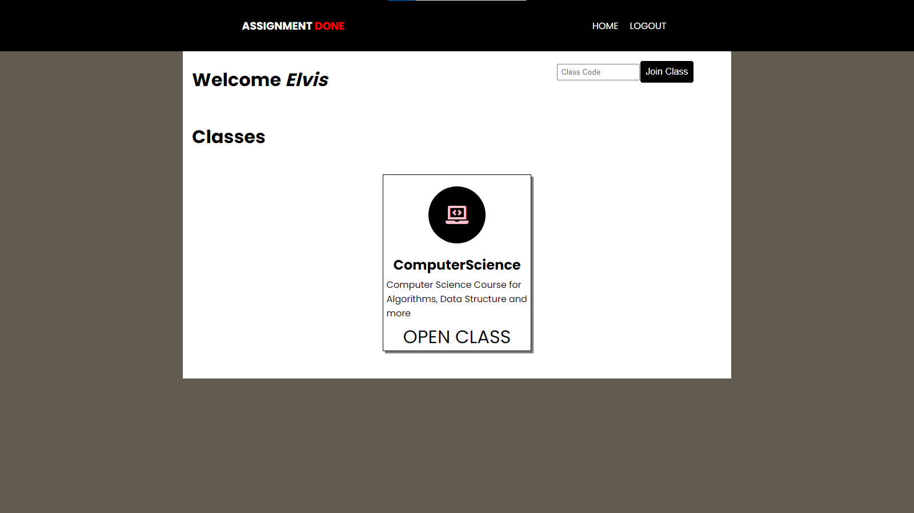
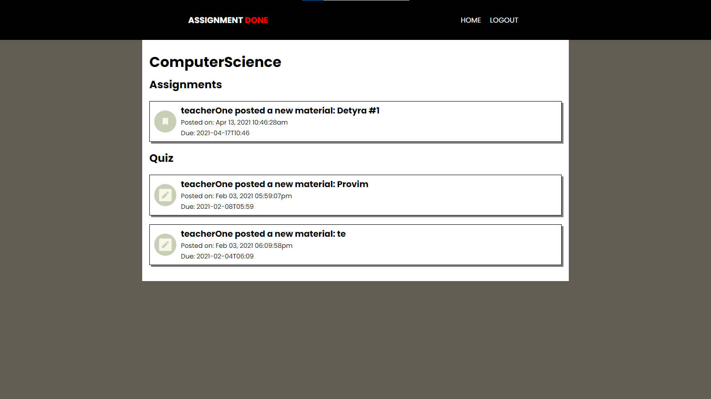
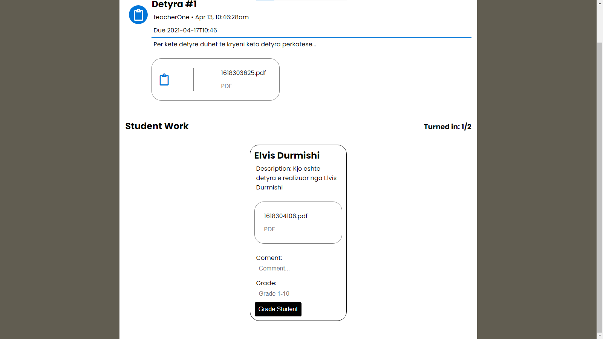

# Assignment Done

##### Description:

Assignment Done is a website where students and teachers can easily share work and assignments between each other. Teachers have full control of the work they share, and can give feedback to their students about their submissions.

###### Current status:

Finished

###### Implementation time:

November 2020

###### Technologies:

HTML, CSS, PHP

##### Contact:

Elvis Durmishi:

[elvisdurmishi@gmail.com](mailto:elvisdurmishi@gmail.com)

[LinkedIn](https://www.linkedin.com/in/elvis-durmishi-0846241b3/)

[GitHub](https://github.com/elvisdurmishi)
